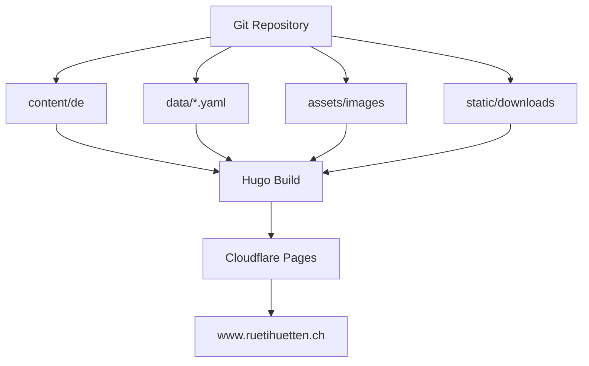

# Architektur

## Prinzipien

- Eine Sprache: Deutsch.
- Wenige Hauptseiten: Aktuell, Kalender, Bauspielplatz, Kontakt & Unterstützen.
- Kalender ist die zentrale Datenquelle für Status, Öffnungen und Events.
- Archiv, Medien und Jahresberichte bleiben auffindbar, aber nicht in der Hauptnavigation.
- Kontakt erfolgt über Mailto-Aktionen statt Formular.
- Externe Medienartikel werden intern als Markdown geparst und externe Bilder intern gesichert, öffentlich aber nur kuratiert verlinkt oder nach Rechteprüfung verwendet.

## Wichtige Templates

- `layouts/index.html`: Startseite als Status-/Kalenderübersicht
- `layouts/partials/status-banner.html`: heute offen / fällt aus / nächste Öffnung
- `layouts/partials/upcoming-events.html`: kommende wichtige Anlässe
- `layouts/shortcodes/kalender-liste.html`: vollständige Kalenderliste
- `layouts/shortcodes/medien-liste.html`: Medienübersicht
- `layouts/shortcodes/kontakt-aktionen.html`: Mailto-Aktionen
- `layouts/shortcodes/jahresberichte-liste.html`: Jahresbericht-Downloads
